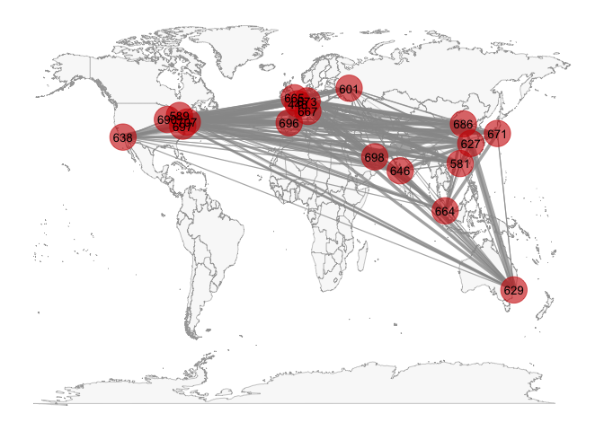

# Introduction

[~ 200 words]

Clearly stated background and questions / hypotheses / problems being addressed. Sets up the analysis in an interesting and compelling way.

The outbreak of COVID-19 has caused a huge impact on the global economy. To estimate the global economy, the research scale has shifted from countries to cities, and researchers no longer merely focus on a single economic unit but try to estimate the interactions among cities. Thus, to understand the global economy under COVID-19, it is vital to look into the economic interactions among cities. The data set World City Network (WCN) and airline network have been applied to the research of city network, while WCN could estimate the interlocking network of cities through the global location strategies of Advance Produce Service (APS) firms, and the air links between cities are used to evaluate local economic development. However, the two datasets have difficulties estimating real-time city economic interaction during COVID-19. Thus, this study aims to apply social network analysis (SNA) to identify the possible mechanism of the rapid chaining economic city network. By applying QAP or exponential-family random graph models on WCN and airline datasets, this research will interpret the transformation of the role of cities and the configuration in the network before and after the outbreak of COVID-19.

# Materials and methods

[~ 200 words]

Narrative: Clear narrative description of the data sources and methods. Includes data from at least two sources that were integrated / merged in R.

Code: The code associated with the project is well organized and easy to follow. Demonstrates mastery of R graphics and functions.

Data: The underlying data are publicly accessible via the web and downloaded/accessed within the Rmd script. If you want to use your own data, you must make it available on a website (e.g. Figshare) so that others are able to re-run your code.

You can do bullets like this:

* The first most important thing
* The second most important thing
* The third most important thing

You can do numbers like this:

1. The first most important thing
2. The second most important thing
3. The third most important thing

See [http://rmarkdown.rstudio.com/](http://rmarkdown.rstudio.com/) for all the amazing things you can do.


Here's my first code chunk.


Load any required packages in a code chunk (you may need to install some packages):


```r
# devtools::install_github("briatte/ggnet")
# install.packages("ggnet")
library(dplyr)
library(igraph)
library(network)
library(intergraph)
library(sna)
library(ggplot2)
library(ggnet)
library(GGally)
```

## Download and clean all required data

```r
svm <- read.csv2("data/da28_svm2016.csv", header=TRUE, sep=",")
air.edge<-read.table("data/2014 airline .csv",sep=",",header = T)
airport_name<-read.csv2("data/airport0825.csv",sep=",",header = T) 
```

## combining airline data and airport data

```r
airport<-c('JFK','LCY','HKG','SIN','PVG','PEK','CDG','HND','DXB','ORD','SYD','FRA','GRU','DCA','LAX','YYZ','MXP','MAD','BOM','ICN')
city_list<-c("London","New York","Hong Kong","Singapore","Shanghai","Paris","Beijing","Tokyo","Chicago","Dubai","Sydney","Frankfurt", "Sao Paulo","Washington","Los Angeles","Milan","Madrid", "Mumbai","Toronto","Moscow")

airport<-cbind(airport,city_list)
air.edge<-air.edge %>%
  filter(Source.airport == "JFK"|Source.airport == "LCY"|
           Source.airport == "HKG"|Source.airport == "SYD"|
           Source.airport == "SIN"|Source.airport == "FRA"|
           Source.airport == "PVG"|Source.airport == "GRU"|
           Source.airport == "PEK"|Source.airport == "DCA"|
           Source.airport == "CDG"|Source.airport == "LAX"|
           Source.airport == "HND"| Source.airport == "YYZ"|
           Source.airport == "DXB"|Source.airport == "MXP"|
           Source.airport == "ORG"|Source.airport == "MAD"|
           Source.airport == "BOM"|Source.airport == "ICN")

air.edge<-air.edge %>%
  filter(Destination.airport == "JFK"|Destination.airport == "LCY"|
           Destination.airport == "HKG"|Destination.airport == "SYD"|
           Destination.airport == "SIN"|Destination.airport == "FRA"|
           Destination.airport == "PVG"|Destination.airport == "GRU"|
           Destination.airport == "PEK"|Destination.airport == "DCA"|
           Destination.airport == "CDG"|Destination.airport == "LAX"|
           Destination.airport == "HND"| Destination.airport == "YYZ"|
           Destination.airport == "DXB"|Destination.airport == "MXP"|
           Destination.airport == "ORG"|Destination.airport == "MAD"|
           Destination.airport == "BOM"|Destination.airport == "ICN")

air.edge
```

    Source.airport Destination.airport
1              HKG                 SIN
2              SIN                 HKG
3              BOM                 DXB
4              DXB                 BOM
5              HKG                 ICN
6              ICN                 HKG
7              HKG                 PVG
8              PVG                 HKG
9              PVG                 SIN
10             SIN                 PVG
11             BOM                 DXB
12             BOM                 HKG
13             BOM                 SIN
14             DXB                 BOM
15             HKG                 BOM
16             SIN                 BOM
17             CDG                 JFK
18             DCA                 JFK
19             DCA                 LAX
20             DCA                 YYZ
21             GRU                 JFK
22             GRU                 LAX
23             HKG                 JFK
24             HKG                 LAX
25             JFK                 CDG
26             JFK                 DCA
27             JFK                 GRU
28             JFK                 HKG
29             JFK                 LAX
30             JFK                 LCY
31             JFK                 MAD
32             JFK                 MXP
33             JFK                 YYZ
34             LAX                 DCA
35             LAX                 GRU
36             LAX                 HKG
37             LAX                 JFK
38             LAX                 MAD
39             LAX                 PVG
40             LAX                 SYD
41             LAX                 YYZ
42             MAD                 JFK
43             MAD                 LAX
44             MXP                 JFK
45             PVG                 LAX
46             SYD                 LAX
47             YYZ                 DCA
48             YYZ                 JFK
49             YYZ                 LAX
50             FRA                 LCY
51             FRA                 MAD
52             LCY                 FRA
53             MAD                 FRA
54             CDG                 YYZ
55             DCA                 YYZ
56             FRA                 YYZ
57             GRU                 YYZ
58             HKG                 YYZ
59             JFK                 YYZ
60             LAX                 YYZ
61             PEK                 YYZ
62             PVG                 YYZ
63             YYZ                 CDG
64             YYZ                 DCA
65             YYZ                 FRA
66             YYZ                 GRU
67             YYZ                 HKG
68             YYZ                 JFK
69             YYZ                 LAX
70             YYZ                 PEK
71             YYZ                 PVG
72             BOM                 CDG
73             CDG                 BOM
74             CDG                 DXB
75             CDG                 FRA
76             CDG                 GRU
77             CDG                 HKG
78             CDG                 HND
79             CDG                 ICN
80             CDG                 JFK
81             CDG                 LAX
82             CDG                 MAD
83             CDG                 PEK
84             CDG                 PVG
85             CDG                 SIN
86             CDG                 YYZ
87             DXB                 CDG
88             FRA                 CDG
89             FRA                 JFK
90             GRU                 CDG
91             HKG                 CDG
92             HND                 CDG
93             ICN                 CDG
94             JFK                 CDG
95             JFK                 FRA
96             JFK                 MAD
97             LAX                 CDG
98             MAD                 CDG
99             MAD                 JFK
100            PEK                 CDG
101            PVG                 CDG
102            SIN                 CDG
103            YYZ                 CDG
104            BOM                 DXB
105            BOM                 FRA
106            DXB                 BOM
107            FRA                 BOM
108            HKG                 ICN
109            HKG                 SIN
110            ICN                 HKG
111            ICN                 SIN
112            SIN                 HKG
113            SIN                 ICN
114            DCA                 LAX
115            JFK                 LAX
116            LAX                 DCA
117            LAX                 JFK
118            CDG                 JFK
119            FRA                 MAD
120            HKG                 SYD
121            JFK                 CDG
122            JFK                 LCY
123            JFK                 MAD
124            JFK                 MXP
125            JFK                 YYZ
126            LAX                 MAD
127            MAD                 FRA
128            MAD                 JFK
129            MAD                 LAX
130            MXP                 JFK
131            SYD                 HKG
132            YYZ                 JFK
133            CDG                 DXB
134            CDG                 HKG
135            CDG                 JFK
136            CDG                 LAX
137            CDG                 YYZ
138            DXB                 CDG
139            HKG                 CDG
140            ICN                 MXP
141            JFK                 CDG
142            JFK                 MXP
143            JFK                 YYZ
144            LAX                 CDG
145            MXP                 JFK
146            YYZ                 CDG
147            DXB                 JFK
148            DXB                 LAX
149            DXB                 MXP
150            JFK                 DXB
151            JFK                 LAX
152            JFK                 MXP
153            LAX                 DXB
154            LAX                 JFK
155            MXP                 DXB
156            MXP                 JFK
157            CDG                 JFK
158            FRA                 LCY
159            JFK                 CDG
160            JFK                 LCY
161            JFK                 MAD
162            JFK                 MXP
163            LAX                 MAD
164            LCY                 FRA
165            LCY                 MAD
166            MAD                 JFK
167            MAD                 LAX
168            MAD                 LCY
169            MXP                 JFK
170            SIN                 SYD
171            SYD                 SIN
172            CDG                 PEK
173            CDG                 PVG
174            DXB                 PEK
175            FRA                 PEK
176            FRA                 PVG
177            GRU                 MAD
178            HKG                 PEK
179            HND                 PEK
180            ICN                 PEK
181            JFK                 PEK
182            LAX                 PEK
183            LAX                 PVG
184            MAD                 GRU
185            MAD                 PEK
186            MXP                 PEK
187            MXP                 PVG
188            PEK                 CDG
189            PEK                 DXB
190            PEK                 FRA
191            PEK                 HKG
192            PEK                 HND
193            PEK                 ICN
194            PEK                 JFK
195            PEK                 LAX
196            PEK                 MAD
197            PEK                 MXP
198            PEK                 PVG
199            PEK                 SIN
200            PEK                 SYD
201            PEK                 YYZ
202            PVG                 CDG
203            PVG                 FRA
204            PVG                 LAX
205            PVG                 MXP
206            PVG                 PEK
207            PVG                 SYD
208            PVG                 YYZ
209            SIN                 PEK
210            SYD                 PEK
211            SYD                 PVG
212            YYZ                 PEK
213            YYZ                 PVG
214            BOM                 HKG
215            CDG                 HKG
216            DXB                 HKG
217            FRA                 HKG
218            HKG                 BOM
219            HKG                 CDG
220            HKG                 DXB
221            HKG                 FRA
222            HKG                 HND
223            HKG                 ICN
224            HKG                 JFK
225            HKG                 LAX
226            HKG                 MXP
227            HKG                 PEK
228            HKG                 PVG
229            HKG                 SIN
230            HKG                 SYD
231            HKG                 YYZ
232            HND                 HKG
233            ICN                 HKG
234            JFK                 HKG
235            LAX                 HKG
236            MXP                 HKG
237            PEK                 HKG
238            PVG                 HKG
239            SIN                 HKG
240            SYD                 HKG
241            YYZ                 HKG
242            HKG                 PEK
243            ICN                 PEK
244            ICN                 PVG
245            PEK                 HKG
246            PEK                 ICN
247            PEK                 PVG
248            PVG                 ICN
249            PVG                 PEK
250            CDG                 JFK
251            CDG                 LAX
252            CDG                 YYZ
253            DCA                 JFK
254            DCA                 LAX
255            FRA                 JFK
256            GRU                 JFK
257            HND                 LAX
258            ICN                 JFK
259            ICN                 LAX
260            JFK                 CDG
261            JFK                 DCA
262            JFK                 FRA
263            JFK                 GRU
264            JFK                 ICN
265            JFK                 LAX
266            JFK                 MAD
267            JFK                 MXP
268            JFK                 PVG
269            JFK                 YYZ
270            LAX                 CDG
271            LAX                 DCA
272            LAX                 HND
273            LAX                 ICN
274            LAX                 JFK
275            LAX                 PVG
276            LAX                 SYD
277            MAD                 JFK
278            MXP                 JFK
279            PVG                 JFK
280            PVG                 LAX
281            SYD                 LAX
282            YYZ                 CDG
283            YYZ                 JFK
284            BOM                 DXB
285            CDG                 DXB
286            DXB                 BOM
287            DXB                 CDG
288            DXB                 FRA
289            DXB                 GRU
290            DXB                 HKG
291            DXB                 HND
292            DXB                 ICN
293            DXB                 JFK
294            DXB                 LAX
295            DXB                 MAD
296            DXB                 MXP
297            DXB                 PEK
298            DXB                 PVG
299            DXB                 SIN
300            DXB                 SYD
301            DXB                 YYZ
302            FRA                 DXB
303            GRU                 DXB
304            HKG                 DXB
305            HND                 DXB
306            ICN                 DXB
307            JFK                 DXB
308            JFK                 MXP
309            LAX                 DXB
310            MAD                 DXB
311            MXP                 DXB
312            MXP                 JFK
313            PEK                 DXB
314            PVG                 DXB
315            SIN                 DXB
316            SIN                 SYD
317            SYD                 DXB
318            SYD                 SIN
319            YYZ                 DXB
320            DXB                 SIN
321            FRA                 JFK
322            FRA                 MAD
323            FRA                 MXP
324            HKG                 ICN
325            ICN                 HKG
326            JFK                 FRA
327            MAD                 FRA
328            MXP                 FRA
329            SIN                 DXB
330            SIN                 SYD
331            SYD                 SIN
332            BOM                 HKG
333            CDG                 JFK
334            HKG                 BOM
335            JFK                 CDG
336            HKG                 PVG
337            ICN                 PVG
338            PVG                 HKG
339            PVG                 ICN
340            GRU                 JFK
341            JFK                 GRU
342            BOM                 SIN
343            SIN                 BOM
344            HKG                 PVG
345            PVG                 HKG
346            HKG                 PEK
347            LAX                 PVG
348            PEK                 HKG
349            PEK                 YYZ
350            PVG                 LAX
351            YYZ                 PEK
352            HKG                 PEK
353            HKG                 PVG
354            PEK                 HKG
355            PVG                 HKG
356            CDG                 JFK
357            FRA                 MAD
358            GRU                 MAD
359            JFK                 CDG
360            JFK                 LCY
361            JFK                 MAD
362            JFK                 MXP
363            LAX                 MAD
364            LCY                 MAD
365            MAD                 FRA
366            MAD                 GRU
367            MAD                 JFK
368            MAD                 LAX
369            MAD                 LCY
370            MAD                 MXP
371            MXP                 JFK
372            MXP                 MAD
373            SIN                 SYD
374            SYD                 SIN
375            CDG                 GRU
376            CDG                 PEK
377            FRA                 GRU
378            GRU                 CDG
379            GRU                 FRA
380            GRU                 JFK
381            GRU                 MAD
382            GRU                 MXP
383            GRU                 YYZ
384            JFK                 GRU
385            MAD                 GRU
386            MAD                 PEK
387            MXP                 GRU
388            PEK                 CDG
389            PEK                 MAD
390            YYZ                 GRU
391            CDG                 HND
392            DXB                 HND
393            HKG                 HND
394            HND                 CDG
395            HND                 DXB
396            HND                 HKG
397            HND                 PEK
398            HND                 SIN
399            PEK                 HND
400            SIN                 HND
401            HKG                 PEK
402            HKG                 PVG
403            PEK                 HKG
404            PVG                 HKG
405            BOM                 ICN
406            CDG                 ICN
407            DXB                 ICN
408            FRA                 ICN
409            GRU                 LAX
410            HKG                 ICN
411            HND                 ICN
412            ICN                 BOM
413            ICN                 CDG
414            ICN                 DXB
415            ICN                 FRA
416            ICN                 HKG
417            ICN                 HND
418            ICN                 JFK
419            ICN                 LAX
420            ICN                 MAD
421            ICN                 MXP
422            ICN                 PEK
423            ICN                 PVG
424            ICN                 SIN
425            ICN                 SYD
426            ICN                 YYZ
427            JFK                 ICN
428            LAX                 GRU
429            LAX                 ICN
430            MAD                 ICN
431            PEK                 ICN
432            PVG                 ICN
433            SIN                 ICN
434            SYD                 ICN
435            YYZ                 ICN
436            FRA                 JFK
437            JFK                 FRA
438            JFK                 MAD
439            MAD                 JFK
440            FRA                 MAD
441            GRU                 MAD
442            MAD                 FRA
443            MAD                 GRU
444            BOM                 FRA
445            CDG                 FRA
446            CDG                 YYZ
447            DXB                 FRA
448            FRA                 BOM
449            FRA                 CDG
450            FRA                 DXB
451            FRA                 GRU
452            FRA                 HKG
453            FRA                 HND
454            FRA                 ICN
455            FRA                 JFK
456            FRA                 LAX
457            FRA                 LCY
458            FRA                 MAD
459            FRA                 MXP
460            FRA                 PEK
461            FRA                 PVG
462            FRA                 SIN
463            FRA                 YYZ
464            GRU                 FRA
465            HKG                 FRA
466            HND                 FRA
467            ICN                 FRA
468            JFK                 FRA
469            LAX                 FRA
470            LCY                 FRA
471            MAD                 FRA
472            MXP                 FRA
473            PEK                 FRA
474            PVG                 FRA
475            SIN                 FRA
476            YYZ                 CDG
477            YYZ                 FRA
478            HKG                 ICN
479            ICN                 HKG
480            DXB                 SIN
481            SIN                 DXB
482            CDG                 PEK
483            CDG                 PVG
484            FRA                 PVG
485            HKG                 PVG
486            HND                 PEK
487            ICN                 PVG
488            JFK                 PVG
489            LAX                 PVG
490            PEK                 CDG
491            PEK                 HND
492            PEK                 PVG
493            PVG                 CDG
494            PVG                 FRA
495            PVG                 HKG
496            PVG                 ICN
497            PVG                 JFK
498            PVG                 LAX
499            PVG                 PEK
500            PVG                 SIN
501            PVG                 SYD
502            SIN                 PVG
503            SIN                 SYD
504            SYD                 PVG
505            SYD                 SIN
506            CDG                 HND
507            FRA                 HND
508            HKG                 HND
509            HND                 CDG
510            HND                 FRA
511            HND                 HKG
512            HND                 ICN
513            HND                 LAX
514            HND                 PEK
515            HND                 SIN
516            ICN                 HND
517            LAX                 HND
518            PEK                 HND
519            PEK                 PVG
520            PVG                 PEK
521            SIN                 HND
522            LAX                 SYD
523            PEK                 PVG
524            PVG                 PEK
525            PVG                 SYD
526            SYD                 LAX
527            SYD                 PVG
528            CDG                 ICN
529            FRA                 ICN
530            HKG                 ICN
531            HND                 ICN
532            ICN                 CDG
533            ICN                 FRA
534            ICN                 HKG
535            ICN                 HND
536            ICN                 JFK
537            ICN                 LAX
538            ICN                 PEK
539            ICN                 PVG
540            ICN                 SIN
541            ICN                 SYD
542            JFK                 ICN
543            LAX                 ICN
544            PEK                 ICN
545            PVG                 ICN
546            SIN                 ICN
547            SYD                 ICN
548            CDG                 MXP
549            MXP                 CDG
550            DXB                 FRA
551            DXB                 SIN
552            DXB                 SYD
553            FRA                 DXB
554            HKG                 SYD
555            HND                 SIN
556            ICN                 SYD
557            JFK                 LAX
558            LAX                 JFK
559            LAX                 SYD
560            PVG                 SYD
561            SIN                 DXB
562            SIN                 HND
563            SIN                 SYD
564            SYD                 DXB
565            SYD                 HKG
566            SYD                 ICN
567            SYD                 LAX
568            SYD                 PVG
569            SYD                 SIN
570            CDG                 JFK
571            JFK                 CDG
572            JFK                 MXP
573            MXP                 JFK
574            CDG                 JFK
575            JFK                 CDG
576            BOM                 SIN
577            CDG                 SIN
578            DXB                 SIN
579            FRA                 JFK
580            FRA                 SIN
581            HKG                 SIN
582            HND                 SIN
583            ICN                 SIN
584            JFK                 FRA
585            MXP                 SIN
586            PEK                 SIN
587            PVG                 SIN
588            SIN                 BOM
589            SIN                 CDG
590            SIN                 DXB
591            SIN                 FRA
592            SIN                 HKG
593            SIN                 HND
594            SIN                 ICN
595            SIN                 MXP
596            SIN                 PEK
597            SIN                 PVG
598            SIN                 SYD
599            SYD                 SIN
600            HKG                 ICN
601            ICN                 HKG
602            ICN                 LAX
603            LAX                 ICN
604            ICN                 SYD
605            SYD                 ICN
606            CDG                 LAX
607            LAX                 CDG
608            HKG                 SIN
609            SIN                 HKG
610            CDG                 YYZ
611            YYZ                 CDG
612            HKG                 SIN
613            SIN                 HKG
614            SIN                 SYD
615            SYD                 SIN
616            CDG                 MAD
617            CDG                 MXP
618            MAD                 CDG
619            MAD                 MXP
620            MXP                 CDG
621            MXP                 MAD
622            FRA                 JFK
623            FRA                 LAX
624            HKG                 SIN
625            HND                 LAX
626            ICN                 JFK
627            ICN                 LAX
628            JFK                 FRA
629            JFK                 ICN
630            JFK                 LAX
631            JFK                 PEK
632            LAX                 FRA
633            LAX                 HND
634            LAX                 ICN
635            LAX                 JFK
636            LAX                 PEK
637            LAX                 PVG
638            LAX                 SYD
639            LAX                 YYZ
640            PEK                 JFK
641            PEK                 LAX
642            PVG                 LAX
643            SIN                 HKG
644            SYD                 LAX
645            YYZ                 LAX
646            HKG                 HND
647            HKG                 ICN
648            HND                 HKG
649            ICN                 HKG
650            CDG                 JFK
651            DCA                 JFK
652            DCA                 LAX
653            DCA                 YYZ
654            FRA                 JFK
655            FRA                 SIN
656            GRU                 JFK
657            GRU                 LAX
658            HKG                 SIN
659            ICN                 SIN
660            JFK                 CDG
661            JFK                 DCA
662            JFK                 FRA
663            JFK                 GRU
664            JFK                 LAX
665            JFK                 MAD
666            JFK                 MXP
667            JFK                 PEK
668            JFK                 YYZ
669            LAX                 DCA
670            LAX                 GRU
671            LAX                 JFK
672            LAX                 PEK
673            LAX                 PVG
674            LAX                 YYZ
675            MAD                 JFK
676            MXP                 JFK
677            PEK                 JFK
678            PEK                 LAX
679            SIN                 FRA
680            SIN                 HKG
681            SIN                 ICN
682            YYZ                 DCA
683            YYZ                 JFK
684            YYZ                 LAX
685            FRA                 MAD
686            GRU                 MAD
687            JFK                 MAD
688            MAD                 FRA
689            MAD                 GRU
690            MAD                 JFK
691            MAD                 MXP
692            MXP                 MAD
693            LAX                 SYD
694            SIN                 SYD
695            SYD                 HKG
696            SYD                 LAX
697            SYD                 SIN
698            FRA                 MAD
699            MAD                 FRA
700            SYD                 HKG
701            JFK                 LAX
702            LAX                 JFK
703            CDG                 MAD
704            MAD                 CDG
705            JFK                 YYZ
706            LAX                 YYZ
707            YYZ                 JFK
708            YYZ                 LAX
709            HKG                 ICN
710            ICN                 HKG
711            PEK                 PVG
712            PVG                 PEK

```r
air.edge<-merge(air.edge,airport,by.x="Source.airport",by.y="airport",all.x=TRUE)
names(air.edge)[3]<-"Source"
air.edge<-merge(air.edge,airport,by.x="Destination.airport",by.y="airport",all.x=TRUE)
names(air.edge[4])<-"Destination"
air.edge<-air.edge[3:4]
```


```r
air.g<- graph.data.frame(air.edge,directed = F)
#V(air.g)$name<-V(air.g)$city_list  

plot(air.g,
     vertex.color="darkgoldenrod1",  #node color
     vertex.size=15,# node size
     node.alpha = 0.6,
     vertex.label.color="black",  #text color
     vertex.label.dist=3,   # text of distance from node
     edge.color="grey74",   #edges color
     edge.width=0.5,
     layout=layout_nicely(air.g),
     alpha=0.5)
```

<!-- -->

```r
Cities <- rownames(svm)
Firms <- colnames(svm)
# svm <- svm[,-c(1:3)]
row.names(svm) <- Cities
svm_mat <- data.matrix(svm, rownames.force=TRUE)

#finding top 20 firms 
firm_sum<-as.data.frame(colSums(svm_mat))
firm20<-firm_sum%>%
  arrange(desc(colSums(svm_mat)))%>%
  slice(n=1:20)
firm_list<-row.names(firm20)


#finding top 20 cities
city_sum<-as.data.frame(rowSums(svm_mat))
city20<-city_sum%>%
  arrange(desc(rowSums(svm_mat)))%>%
  slice(n=1:20)
city_list<-row.names(city20)


svm_mat_small<-svm_mat[city_list,]
svm_mat_small<-svm_mat_small[,firm_list]


city_m<-tcrossprod(svm_mat_small, y=NULL)
firm_m<-tcrossprod(t(svm_mat_small), y=NULL)

# nw <- cbind(rbind(firm_nw, diag(20)), rbind(diag(20), city_nw))
# nw <- network(nw, directed = T)
# nw%v%"layer.mem" <- c(rep(1, 20), rep(2, 20))
# nw%v%"type" <- rep(types, 2)

diag(firm_m)<-0
firm_m<-firm_m*0.01
firm_m<-rbind(firm_m[1:15,]*0,firm_m[16:20,])
firm.g<- graph.adjacency(firm_m, mode="undirected",weighted = NULL) #igraph
#plot(firm.g)
plot(firm.g, 
     vertex.color="steelblue2",  #node color
     vertex.size=15,# node size
     vertex.label.color="black",  #text color
     vertex.label.dist=3,   # text of distance from node
     edge.color="grey74",   #edges color
     edge.width=0.5,
     alpha=0.5,
     vertex.shape="square",
     layout=layout_nicely(firm.g),
     vertex.frame.color="#ffffff")   # lwd of edges
```

<!-- -->


```r
city_m<-tcrossprod((svm_mat_small), y=NULL)
diag(city_m)<-0
city_m<- as.matrix(city_m)
city_nw <- graph.incidence(city_m,weighted = T) #network
plot(city_nw)
```

<!-- -->

```r
row.names(city_m)
```

```
##  [1] "665" "707" "581" "664" "627" "448" "686" "671" "690" "698" "629" "673"
## [13] "573" "697" "638" "667" "696" "646" "589" "601"
```

```r
city_cor<- read.csv2("data/20city_coor_1010.csv", header=TRUE, sep=",")


city_nw<-set_vertex_attr(graph=city_nw,name="lat", value=city_cor$lat)
city_nw<-set_vertex_attr(graph=city_nw,name="lon", value=city_cor$lon)

plot(city_nw)# feed centroid coordinates to igraph)
```

<!-- -->

```r
flights <- network(city_m, directed = TRUE)

flights %v% "lat" <- as.numeric(city_cor$lat)
flights %v% "lon" <- as.numeric(city_cor$lon)
```

```
## Warning: NAs introduced by coercion
```

```r
flights %v% "City"<- city_cor$City

invisible(lapply(c("ggplot2", "maps", "network", "sna"), base::library, character.only = TRUE))

world <- fortify(maps::map("world", plot = FALSE, fill = TRUE))
world <- ggplot(world, aes(x = long, y = lat)) +
  geom_polygon(aes(group = group), color = "grey65",
               fill = "#f9f9f9", size = 0.2)

a<-as.vector((rnorm(342,0.5,0.4))^2)
p <- ggnetworkmap(world,flights,
                  node.color = "red3",
                  node.alpha = 0.6,
                  great.circles = FALSE,
                  segment.color="gray60",
                  label.nodes = TRUE,
                  label.size = 3.5,
                  size=10,
                  segment.size = a)+
  labs(color="nodes")
plot(p)
```

```
## Warning: Removed 1 rows containing missing values (geom_point).
```

```
## Warning: Removed 1 rows containing missing values (geom_text).
```

<!-- -->


```r
library(mapview) 
library(leaflet)
#mapview(flights)
```


# Results

[~200 words]

Tables and figures (maps and other graphics) are carefully planned to convey the results of your analysis. Intense exploration and evidence of many trials and failures. The author looked at the data in many different ways before coming to the final presentation of the data.
    
Show tables, plots, etc. and describe them.


# Conclusions

[~200 words]

Clear summary adequately describing the results and putting them in context. Discussion of further questions and ways to continue investigation.    

# References

All sources are cited in a consistent manner
